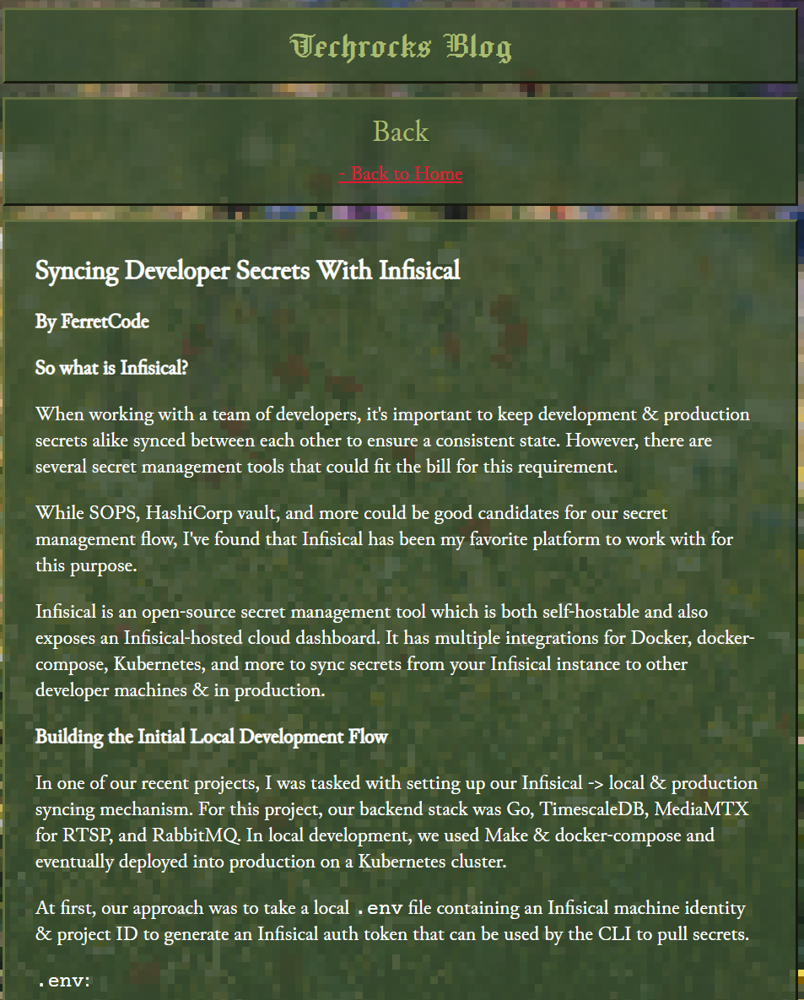

# techrocks

A CLI tool for generating beautiful blog posts based on markdown documents


<br>
<a href="https://techrocks.frrt.space">Image Source</a>

## usage

```
./techrocks -input post.md -output output.html -template template.html
```

It may also be used with these default values:

-   input=post.md
-   template=template.html
-   output=output.html

Usage like:

```
./techrocks
```

## template format

techrocks will replace {{.Content}} with the generated markdown HTML

```html
<!DOCTYPE html>
<html>
    <head>
        <title>Markdown Rendered</title>
        <meta charset="UTF-8" />
        <meta name="viewport" content="width=device-width, initial-scale=1.0" />
    </head>
    <body>
        {{ .Content }}
    </body>
</html>
```

## building

```
go build -o techrocks ./main.go
```
